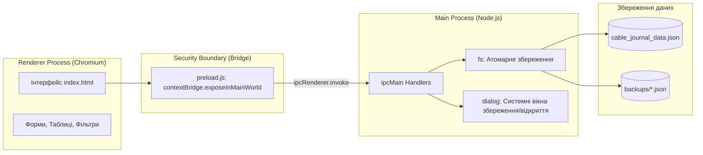

# 🏛️ Архітектура CableJournal

## 1. Загальний огляд

**CableJournal** побудовано за трикомпонентною моделлю платформи **Electron**:

1. **Main Process (Node.js)** — [main.js](file:///d:/my_projects/CableJournal-main/main.js): керує життєвим циклом вікон додатку, конфігурацією середовища, прямим доступом до файлової системи через модуль `fs` та системними діалогами Windows (`dialog`).
2. **Preload Script (Bridge)** — [preload.js](file:///d:/my_projects/CableJournal-main/preload.js): забезпечує безпечну ізоляцію контекстів (`contextIsolation: true`) через API `contextBridge`, відкриваючи для інтерфейсу лише строго типізований набір IPC-методів.
3. **Renderer Process (UI)** — [index.html](file:///d:/my_projects/CableJournal-main/index.html): відповідає за представлення даних, реакцію на взаємодію користувача, локальну фільтрацію, рендеринг списків, розрахунок статистики та генерацію звітів (CSV, XML, HTML, Print).



---

## 2. Безпека та пісочниця

- **Context Isolation:** У вікні [createWindow](file:///d:/my_projects/CableJournal-main/main.js#L39-L59) встановлено `contextIsolation: true` та `nodeIntegration: false`. Це унеможливлює виконання довільних системних команд Node.js безпосередньо з DOM-дерева.
- **Content Security Policy (CSP):** Задає обмеження на джерела завантаження скриптів, шрифтів та стилів:
  ```html
  <meta
    http-equiv="Content-Security-Policy"
    content="default-src 'self'; script-src 'self' 'unsafe-inline' https://cdn.jsdelivr.net; style-src 'self' 'unsafe-inline' https://cdn.jsdelivr.net https://fonts.googleapis.com; font-src https://fonts.gstatic.com;"
  />
  ```
- **IPC Whitelisting:** Усі звернення до системних ресурсів відбуваються через декларативні канали:
  - `load-data`: асинхронне читання JSON-бази.
  - `save-data`: атомарний запис списку записів.
  - `export-data`: виклик `dialog.showSaveDialog` з наступним записом файлу.
  - `import-data`: виклик `dialog.showOpenDialog` з парсингом обраного файлу.
  - `get-data-path`: отримання абсолютного шляху до активного файлу сховища.
  - `backup-data`: автоматичне створення версіованого бекапу.

---

## 3. Механізм Portable-сховища

Для забезпечення портативності (робота з USB-носія без прав адміністратора) функція `getDataFilePath()` виконує динамічну резолюцію шляху:

1. Якщо додаток запущено у режимі розробки (`!app.isPackaged`), дані зберігаються у корені робочої папки проекту.
2. Якщо додаток скомпільовано як portable exe (`process.env.PORTABLE_EXECUTABLE_DIR`), дані зберігаються в каталозі поруч із `.exe`.
3. У разі аварійного запуску без змінних середовища шлях обчислюється через директорію виконуваного файлу `path.dirname(app.getPath('exe'))`.

---

## 4. Стійкість до збоїв (Atomic Writes)

Операції збереження `save-data` та `backup-data` використовують двофазний атомарний запис:

1. Серіалізований рядок JSON спочатку записується у тимчасовий файл `${dataFilePath}.tmp`.
2. Операційна система виконує атомарну заміну оригінального файлу через `fs.renameSync(tempFilePath, dataFilePath)`.
3. Це виключає ризик утворення файлів нульової довжини при збоях живлення.
